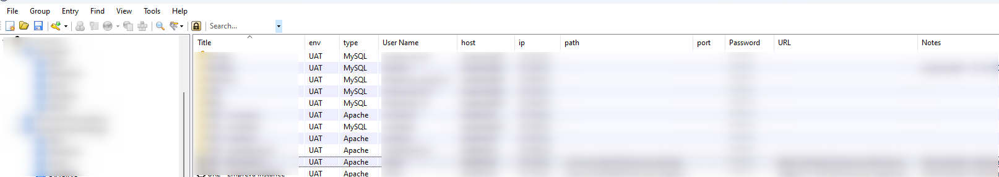

# Advanced properties

> Advanced properties are called `Custom strings` in the KeePass terminology.

It can be really useful to force KeePass to display some extra information like the `hostname` and f.i. the `IP address` of a server.

This can be done by right-clicking on the column title bar then choosing *Configure Columns*. 

If you don't see the new added columns, just resize the first ones.

Make sure to always fill in these properties:

* The `env` property will contains the environment like `UAT` for user-acceptance tests or `PROD` for the production server,
* The `ip` is to store the IP address of the server,
* The `host` will be initialized to the name of the home in a human-readable way and
* The `type` property will be used to determine the type of the server f.i. `Apache`, `MySQL`, `PostgreSQL`, ...

Additional useful properties:

* Use `DB` to save their the associated database name (when `type` is a database system like `MySQL` or `PostgreSQL`),
* Use `path` to store the path to the application f.i. `/var/www/html/public` if this is the entry path of your application and,
* `port` to expose the port to use for, f.i., your database connection (f.i. `3307` if you don't use the standard MySQL port)

## Using an advanced property in a URL overriding

> Custom strings can be referenced using {S:Name}. For example, if you have a custom string named "eMail", you can use the placeholder {S:eMail}.

To do this, use the `{S:xxx}` syntax like this: `cmd://putty.exe  -load "Default Settings" {S:host} -l {USERNAME} -pw {PASSWORD}`. This command will allow you to run `putty` and thus a `ssh` connection on the server.
