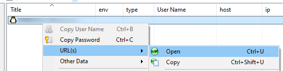

# Right-click and open

You can right-click on an entry and select `Open` to run an action like opening a website or a file.

## Open another kdbx database

Imagine you've an entry to point to a second `kbdx`. Idea is to be able to open it without to have the prompt for the password.

The `URL` property of the entry should be: `cmd://"{APPDIR}\KeePass.exe" "{s:DbPath}" -pw-enc:{PASSWORD_ENC}`.

Make sure to specify the password to use.

Then, go in the `Advanced` tab (of the `Edit Entry` dialog), add a new `String fields`, the name has to be `DbPath` and you need to specify the full path of the database (f.i. `%APPDATA%\my_second_db.kdbx`).

This done, just right-click on the entry and select `Open`

A new instance of KeePass will be started and your database opened; without the password prompt.
