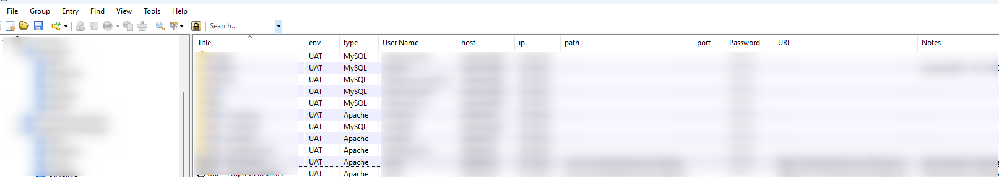
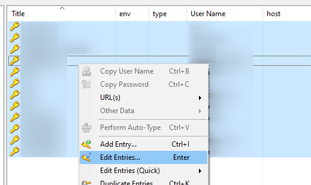

<!-- This file has been generated by the concat.sh script. -->
<!-- Don't modify this file manually (you'll loose your changes) -->
<!-- but run the tool once more -->
<!-- Last refresh date: Tuesday, October 03, 2023, 11:34:11 -->

<!-- markdownlint-disable MD033 MD041 -->

# KeePass tips

> List of tips and tricks for [KeePass](https://keepass.info/)

<!-- table-of-contents - start -->
* [Configuration file](#configuration-file)
* [Advanced properties](#advanced-properties)
  * [Using an advanced property in a URL overriding](#using-an-advanced-property-in-a-url-overriding)
* [Overriding the URL field](#overriding-the-url-field)
  * [Start Putty from KeePass](#start-putty-from-keepass)
  * [Start WinSCP from KeePass](#start-winscp-from-keepass)
  * [Start a RDP/TS connection from KeePass](#start-a-rdp-ts-connection-from-keepass)
* [Tips](#tips)
  * [Multiple selection](#multiple-selection)
  * [Right-click and open](#right-click-and-open)
    * [Open another kdbx database](#open-another-kdbx-database)<!-- table-of-contents - end -->

## Configuration file

The file is stored in folder `%APPDATA%\KeePass` and is called `KeePass.config.xml`. We can retrieve there, f.i., the list of columns to display (node `Configuration/MainWindow/EntryListColumnCollection`).

## Advanced properties

> Advanced properties are called `Custom strings` in the KeePass terminology.

It can be really useful to force KeePass to display some extra information like the `hostname` and f.i. the `IP address` of a server.

This can be done by right-clicking on the column title bar then choosing *Configure Columns*. 

If you don't see the new added columns, just resize the first ones.

Make sure to always fill in these properties:

* The `env` property will contains the environment like `UAT` for user-acceptance tests or `PROD` for the production server,
* The `ip` is to store the IP address of the server,
* The `host` will be initialized to the name of the home in a human-readable way and
* The `type` property will be used to determine the type of the server f.i. `Apache`, `MySQL`, `PostgreSQL`, ...

Additional useful properties:

* Use `path` to store the path to the application f.i. `/var/www/html/public` if this is the entry path of your application and,
* `port` to expose the port to use for, f.i., your database connection (f.i. `3307` if you don't use the standard MySQL port)

### Using an advanced property in a URL overriding

> Custom strings can be referenced using {S:Name}. For example, if you have a custom string named "eMail", you can use the placeholder {S:eMail}.

To do this, use the `{S:xxx}` syntax like this: `cmd://putty.exe  -load "Default Settings" {S:host} -l {USERNAME} -pw {PASSWORD}`. This command will allow you to run `putty` and thus a `ssh` connection on the server.

## Overriding the URL field

The `url` field can also be used to start a program and, thus, not only to contains a valid URL.

The official documentation is located here: [https://keepass.info/help/base/autourl.html](https://keepass.info/help/base/autourl.html).

### Start Putty from KeePass

If you don't have putty installed on your machine, download it from [https://www.putty.org/](https://www.putty.org/). You just need the `putty.exe` file.

Download it and save `putty.exe` in a directory present in your PATH.

To do this, even if you're not an administrator of your machine, just start a MS DOS console and run `echo %PATH%`. You'll then see the list of directories already present and take the one where you can copy a new file. Then copy putty.exe in that folder. So, from now, you can just run `putty.exe` from everywhere.

Update your KeePass entry and set the `URL` property to the following instruction: `cmd://putty.exe  -load "Default Settings" {S:host} -l {USERNAME} -pw {PASSWORD}`

> ℹ️ **IMPORTANT NOTICE**
> Make sure you have fill in the `host` advanced property.

### Start WinSCP from KeePass

> [https://winscp.net/eng/docs/integration_keepass](https://winscp.net/eng/docs/integration_keepass)

If you wish to open WinSCP and see files, you can achieve this by updating  your KeePass entry and set the `URL` property to the following instruction: `cmd://"{ENV_PROGRAMFILES_X86}\WinSCP\WinSCP.exe" sftp://{USERNAME}:{PASSWORD}@{S:ip}:{T-REPLACE-RX:/{S:port}/-1//}{S:path}`

> ℹ️ **IMPORTANT NOTICE**
> Make sure you have fill in the `ip` advanced property. You can also set the `port` and `path` properties; but they are optional.

### Start a RDP/TS connection from KeePass

> [https://keepass.info/help/base/autourl.html](https://keepass.info/help/base/autourl.html)

You can also start a remote desktop / terminal server connection from within KeePass.

The URL has to be set like this: `cmd://mstsc.exe /v:{S:host} /f`

> ℹ️ **IMPORTANT NOTICE**
> Make sure you have fill in the `host` advanced property.

## Tips

### Multiple selection

You can select multiple items then right-click and edit properties like setting the `env` property at once.

Only the added/updated properties will be modified.

### Right-click and open

You can right-click on an entry and select `Open` to run an action like opening a website or a file.

#### Open another kdbx database

Imagine you've an entry to point to a second `kbdx`. Idea is to be able to open it without to have the prompt for the password.

The `URL` property of the entry should be: `cmd://"{APPDIR}\KeePass.exe" "{s:DbPath}" -pw-enc:{PASSWORD_ENC}`.

Make sure to specify the password to use.

Then, go in the `Advanced` tab (of the `Edit Entry` dialog), add a new `String fields`, the name has to be `DbPath` and you need to specify the full path of the database (f.i. `%APPDATA%\my_second_db.kdbx`).

This done, just right-click on the entry and select `Open`

A new instance of KeePass will be started and your database opened; without the password prompt.
