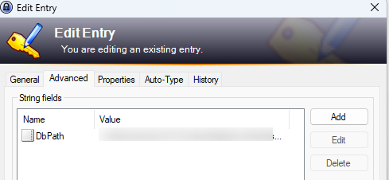

<!-- This file has been generated by the concat.sh script. -->
<!-- Don't modify this file manually (you'll loose your changes) -->
<!-- but run the tool once more -->
<!-- Last refresh date: Monday, October 02, 2023, 17:09:26 -->

<!-- markdownlint-disable MD033 MD041 -->

# KeePass tips

> List of tips and tricks for [KeePass](https://keepass.info/)

<!-- table-of-contents - start -->
* [Configuration file](#configuration-file)
* [Advanced properties](#advanced-properties)
* [Tips](#tips)
  * [Right-click and open](#right-click-and-open)
    * [Open another kdbx database](#open-another-kdbx-database)<!-- table-of-contents - end -->

## Configuration file

The file is stored in folder `%APPDATA%\KeePass` and is called `KeePass.config.xml`. We can retrieve there, f.i., the list of columns to display (node `Configuration/MainWindow/EntryListColumnCollection`).

## Advanced properties

It can be really useful to force KeePass to display some extra information like the `hostname` and f.i. the `IP address` of a server.

This can be done by right-clicking on the column title bar then choosing *Configure Columns*. 

If you don't see the new added columns, just resize the first ones.

Make sure to always fill in these properties:

* The `env` property will contains the environment like `UAT` for user-acceptance tests or `PROD` for the production server,
* The `ip` is to store the IP address of the server,
* The `host` will be initialized to the name of the home in a human-readable way and
* The `type` property will be used to determine the type of the server f.i. `Apache`, `MySQL`, `PostgreSQL`, ...

Additional useful properties:

* Use `path` to store the path to the application f.i. `/var/www/html/public` if this is the entry path of your application and,
* `port` to expose the port to use for, f.i., your database connection (f.i. `3307` if you don't use the standard MySQL port)

## Tips

### Right-click and open

You can right-click on an entry and select `Open` to run an action like opening a website or a file.

#### Open another kdbx database

Imagine you've an entry to point to a second `kbdx`. Idea is to be able to open it without to have the prompt for the password.

The `URL` property of the entry should be: `cmd://"{APPDIR}\KeePass.exe" "{s:DbPath}" -pw-enc:{PASSWORD_ENC}`.

Make sure to specify the password to use.

Then, go in the `Advanced` tab (of the `Edit Entry` dialog), add a new `String fields`, the name has to be `DbPath` and you need to specify the full path of the database (f.i. `%APPDATA%\my_second_db.kdbx`).

This done, just right-click on the entry and select `Open`

A new instance of KeePass will be started and your database opened; without the password prompt.
